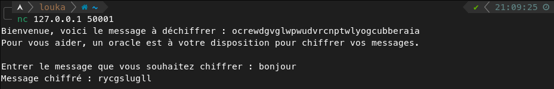
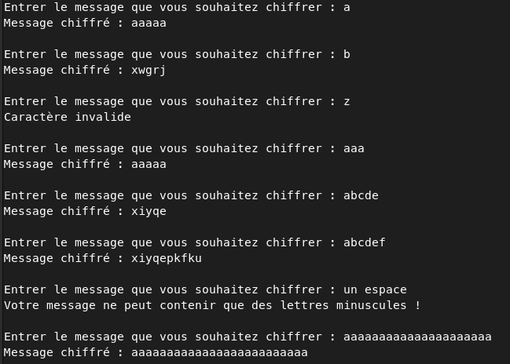
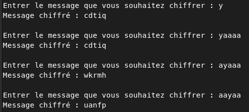
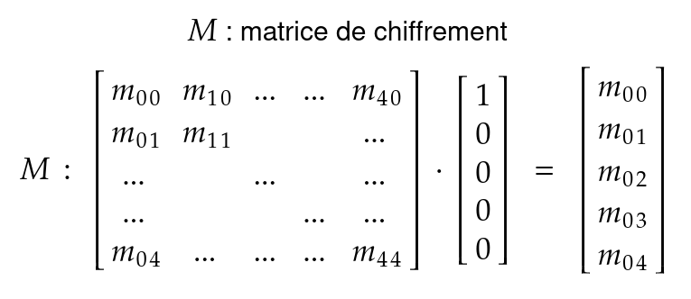
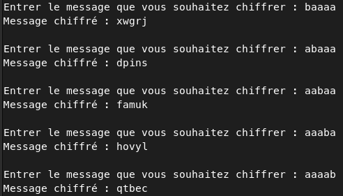
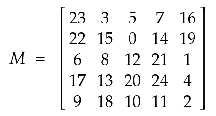
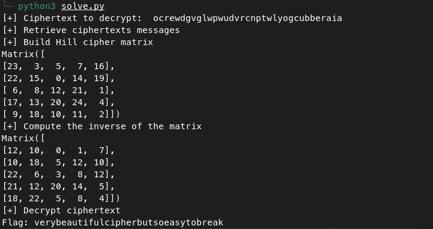

# Jeanned'Hack CTF - Writeup

## Collines et matrices

| Catégorie | Difficulté | Points  |
|-----------|------------|---------|
| Crypto    | Moyen      | 995     |

## Description

Jeanne d'Arc traverse les collines escarpées de la France médiévale, découvrant des runes gravées dans la pierre renfermant des secrets anciens.

## Découverte du challenge

Le challenge consistait en un serveur distant qui permettait à n'importe qui s'y connectant de chiffrer des messages.
Il s'agit donc d'un oracle de chiffrement.
Lorsqu'on s'y connecte le serveur affiche le message suivant, puis nous propose de chiffrer un message :



Le but du challenge va donc être de comprendre la méthode de chiffrement utilisé, pour ensuite trouver un moyen de déchiffrer le message : `ocrewdgvglwpwudvrcnptwlyogcubberaia`.

On peut commencer par quelques tests :



Avec ces tests on peut comprendre déjà plusieurs choses :

- Le message chiffré est toujours d'une longueur multiple de 5. Le chiffrement est donc probablement un chiffrement par bloc de taille 5. Il peut y avoir du padding.
- L'alphabet est constitué des lettres `a` à `y`, donc de taille 25. Seules les lettres minuscules sont acceptés et la lettre `z` est refusée.
- Un mot composé uniquement de `a` ne renverra que des `a` également.

Encore d'autre tests :



Ces tests apportent d'autres éléments :

- Le `a` joue le rôle d'élément neutre dans le chiffrement. En ajoutant des `a` à la fin d'un mot on ne modifiera pas le chiffré.
- La position du caractère est importante. Même en complétant avec des `a` (neutre), le chiffré de `yaaaa` et différent du chiffré de `ayaaa` ou `aayaa` par exemple.

On peut encore faire beaucoup de tests pour essayer de comprendre quelle est la nature du chiffrement, mais on va passer directement au coeur du sujet.

À l'aide des éléments que l'on a jusque là, ainsi que les indices dans le nom du challenge, "collines" (**hill** en anglais), et "matrices", on peut en déduire qu'il s'agit du [chiffre de Hill](https://fr.wikipedia.org/wiki/Chiffre_de_Hill) (**Hill cipher**).

Bien sûr, la déduction n'est pas évidente, il faut faire beaucoup de tests et bien mettre à plat les indices trouvés.

## Cryptanalyse du chiffre de Hill

En fait, une fois que l'on a compris de quelle chiffrement il s'agit le plus dur est fait.

En effet, le chiffre de Hill est un chiffrement très basique. Chaque lettre de l'alphabet est transposé en chiffre (a=1, b=2, ..., y=25). La clé secrète est une matrice carré de taille *N* (ici 5), est le chiffrement consiste à découper le message en bloc de *N* caractères puis d'appliquer un produit matrice vecteur (modulo la taille de l'alphabet) entre la clé et chaque bloc.

Pour déchiffrer, il faut appliquer un produit matrice vecteur entre chaque bloc chiffré et l'inverse de la clé (encore une fois modulo la taille de l'alphabet).

Ici, le fait de posséder un oracle de chiffrement permet de retrouver la matrice de chiffrement, et à partir de celle-ci calculer son inverse et pouvoir déchiffrer le message. L'astuce est d'utiliser les lettres `a` (0) et `b` (1) pour retrouver les colonnes de la matrice.

En envoyant le message `baaaa` on effectue le produit matrice vecteur suivant :



Le message chiffré correspond alors à la première colonne de la matrice de chiffrement. On fait la même chose pour les autres colonnes en envoyant les messages `abaaa`, `aabaa`... et on récupére de cette manière toute la clé.



Une fois décodée :



Il ne reste plus maintenant qu'à calculer son inverse et déchiffrer le message, et on retrouve le flag : `verybeautifulcipherbutsoeasytobreak`.

## Script de résolution

```python
import re
import socket
import string

from time import sleep
from pprint import pprint
from sympy import Matrix

# HOST = "127.0.0.1"
HOST = "142.93.36.168"
PORT = 50001


def solve():
    s = socket.socket(socket.AF_INET, socket.SOCK_STREAM)
    s.connect((HOST, PORT))

    welcome = s.recv(1024).decode()
    ciphertext = re.search("le message à déchiffrer : ([a-y]+)", welcome).group(1)
    print("[+] Ciphertext to decrypt: ", ciphertext)

    ciphertexts = []
    
    print("[+] Retrieve ciphertexts messages")
    sleep(0.5)

    for msg in ["baaaa", "abaaa", "aabaa", "aaaba", "aaaab"]:
        s.sendall(f"{msg}\n".encode())
        sleep(0.5)
        resp = s.recv(1024).decode()
        r = re.search(r"Message chiffré : ([a-y]{5})", resp)
        ciphertexts.append(r.group(1))
        sleep(0.5)

    print("[+] Build Hill cipher matrix")

    alph = string.ascii_lowercase[:-1]
    size = len(alph)
    matrix = [[], [], [], [], []]
    line = 0

    for column in ciphertexts:
        vect = [alph.index(c) for c in column]
        for i in range(5):
            matrix[i].append(vect[i])

    M = Matrix(matrix)    
    pprint(M)

    print("[+] Compute the inverse of the matrix")

    invM = M.inv_mod(size)
    pprint(invM)

    print("[+] Decrypt ciphertext")

    flag = ''
    for chunk in [ciphertext[i:i+5] for i in range(0, len(ciphertext), 5)]:
        vect = Matrix([alph.index(c) for c in chunk])
        plain = invM * vect
        flag += ''.join(alph[i % size] for i in plain)

    print("Flag:", flag)

    s.close()


if __name__ == "__main__":
    solve()
```

Résultat en image :

