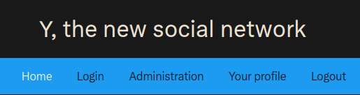

# Jeanned'Hack CTF - Writeup

## Réseau social Y - 1/3

| Catégorie | Difficulté | Points |
|-----------|------------|--------|
| Web       | Moyen      | 916    |

### Étape 1 : Connexion en tant qu'utilisateur

Premièrement, on arrive sur une page d'accueil avec plusieurs onglets, un formulaire de connexion, une page de profil et un espace d'administration.



On peut supposer que la première étape va être de se connecter. Cette première étape est très simple, en se rendant sur la page de connexion on peut trouver des identifiants oubliés dans les commentaires :


On peut donc maintenant se connecter en tant que `johndoe`. Cependant cette utilisateur n'est pas administrateur. Le flag est probablement dans l'onglet admin, il faut donc trouver un moyen maintenant de devenir admin.

### Étape 2 : Accès à la fonctionnalité en développement

En arrivant sur la page de profil, un message nous indique que le site est en construction mais qu'il sera bientôt possible de rechercher d'autres utilisateurs :

```
Our social network is under construction, you will be able soon to search for others users ! 
```

En inspectant le code source on peut trouver comme évoqué un lien vers une page de recherche : `/search`.


Cependant en s'y rendant on obtient une erreur `404 NOT FOUND` :


Cette page est inaccessible mais les messages laissent à penser qu'elle pourrait être intéressante.

Sur la page de profile, on peut trouver deux liens vers d'autres pages utilisant le chemin `/profile?p=<param>`. Ce paramètre semble être utilisé pour charger différentes pages de l'application. On peut donc tenter d'accéder à la page de recherche via ce paramètre `p` :

```
http://<ip_challenge>/profile?p=search
```


### Étape 3 : Exploitation d'une injection SQL

Grâce à cette vulnérabilité, on a maintenant accès à la fonctionnalité de recherche d'utilisateurs. On peut supposer que l'application utilise une base de données et que ce formulaire va rechercher des utilisateurs dans celle-ci. Étant donné que la page n'est pas terminé, cette page est peut être vulnérable à une injection SQL.

En envoyant dans via le formulaire le caractère `'` on obtient une erreur 500, ce qui confirme cette hypothèse. Lorsque l'on fait une recherche légitime on récupère 2 informations, la requête SQL doit donc récupérer 2 champs.

On peut vérifier en envoyant la valeur suivante :
```
' union select "sqli","test" -- -
```


L'injection est confirmée et elle est exploitable, on va donc maintenant tenter de récupérer le mot de passe de l'administrateur.

Il faut maintenant trouver la technologie de base de données utilisée. Après plusieurs essais on peut voir que la requête suivante renvoie un numéro de version :
```
' union select "sqli",sqlite_version() -- -
```


Cela indique que le type de base de données utilisé est **SQLite**.

On peut maintenant rechercher le schéma de la DB pour retrouver la ou les tables utilisées :
```
' union select 1,sql from sqlite_master -- -
```


Il y a donc une table `users` avec les colonnes `username`, `password` et `role`. On peut alors extraire les noms d'utilisateurs et mots de passes :
```
' union select username,password from users -- -
```


Grâce au mot de passe de l'administrateur on peut enfin accéder à la section d'administration et récupérer le flag :


