# Jeanned'Hack CTF - Writeup

## Réseau social Y - 2/3

| Catégorie | Difficulté | Points |
|-----------|------------|--------|
| Web       | Moyen      | 995    |

La suite du premier challenge sur Y, le nouveau réseau social.

### Étape 1 : JWT algorithm confusion

On part donc de la même application, avec le même menu de connexion, mais cette fois-ci un formulaire d'enregistrement est disponible.
En créant un compte et se connectant on se rend compte que l'authentification se fait maintenant en utilisant des JWT (JSON Web Tokens).

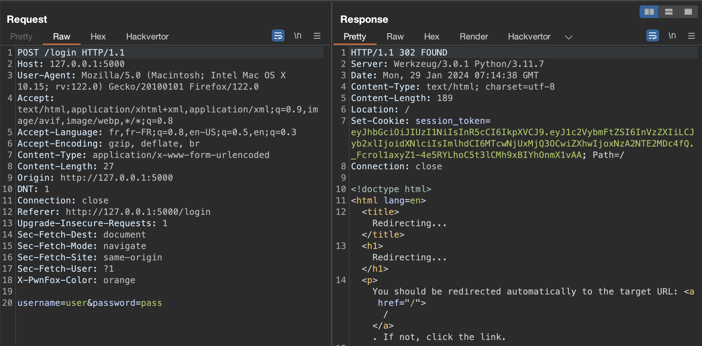

Une fois connecté on peut voir deux sections, administration et moderation, pour lesquels on a besoin de droits supplémentaires :

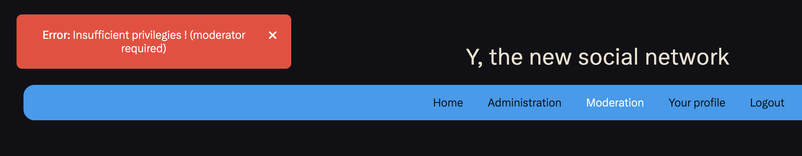

En inspectant le JWT obtenu, on peut identifier qu'un champ `role` est utilisé :

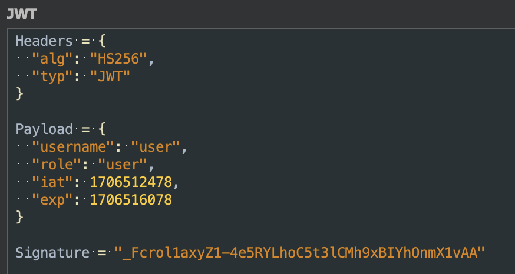

Étant donné l'utilisation de ces rôles et des JWT on peut tenter une attaque sur les JWT, en modifiant l'algorithme utilisé à `None` (algorithm confusion).
Cela pourra permettre de modifier ensuite le groupe de notre utilisateur.

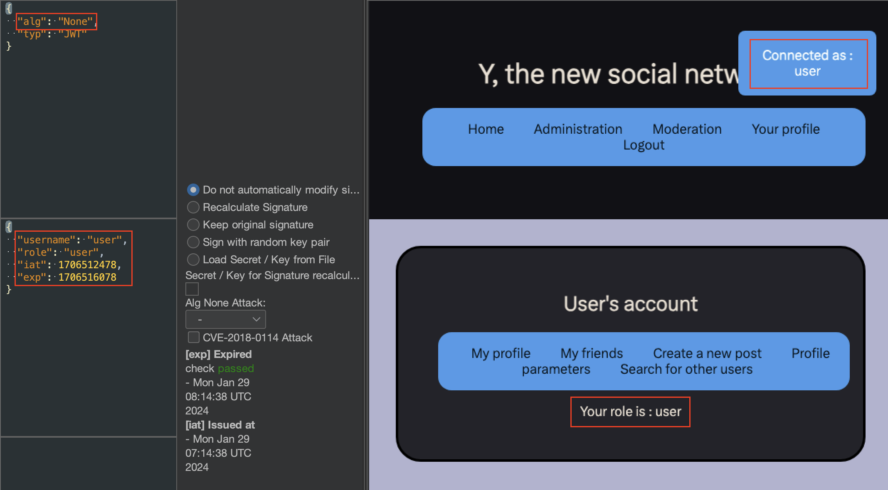

Après modification du jeton, on a quand même accès à notre profile, ce qui indique que le serveur vérifie mal le JWT. On peut utiliser cette vulnérabilité pour tenter d'accéder aux autres onglets en utilisant les rôles `moderator` et `administrator` qu'on a pu trouver dans les messages d'erreurs.

L'attaque fonctionne et nous permet d'accéder au panneau de modération :

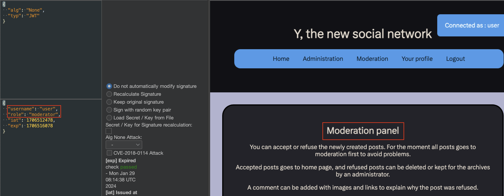

Cependant, elle ne fonctionne pas pour l'accès au menu administrateur, un jeton MFA (multi-factor authentication) est requis :

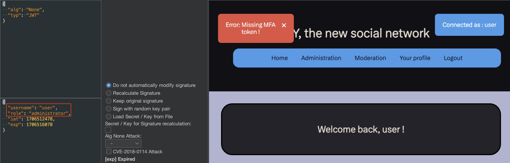

Il va donc falloir trouver un moyen de récupérer ce jeton MFA, ou bien trouvé une autre vulnérabilité pour contourner cette sécurité.

### Étape 2 : XSS stockée

Regardons dans un premier temps du côté de l'onglet de modération :

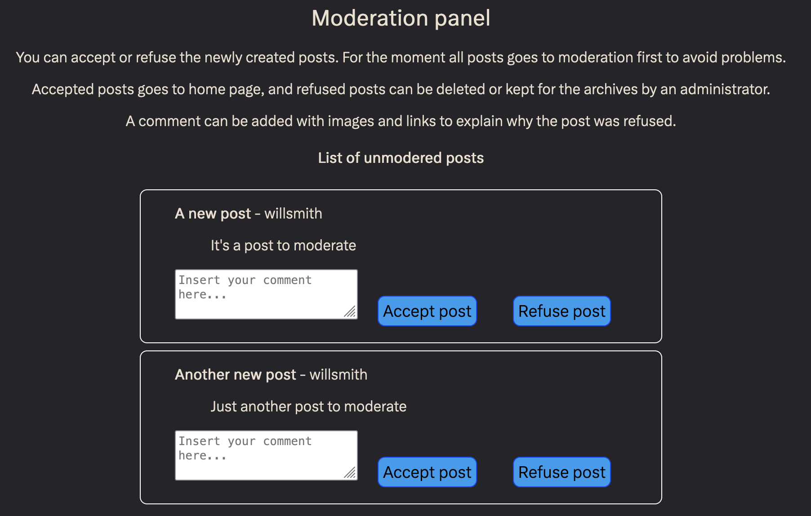

Cette page permet d'accepter ou de refuser les nouveaux postes avant d'être affiché sur la page d'accueil. Les postes refusés sont envoyés à l'administrateur pour qu'il décide de les supprimer ou non, et de plus un commentaire peut être ajouté avec des images ou des liens.

On peut donc tenter d'injecter du code JavaScript pour voir si le champ de commentaire est vulnérable à une XSS.

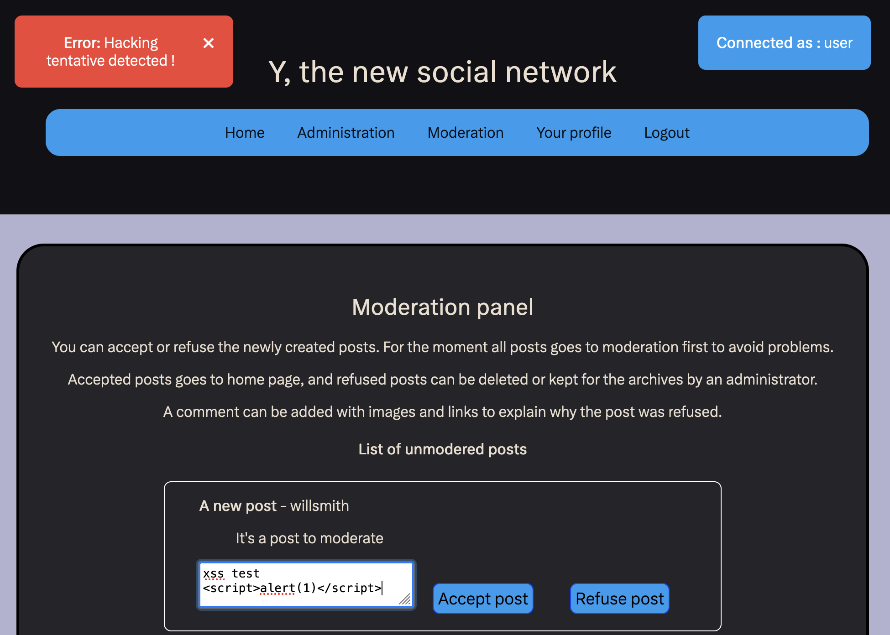

En tentant d'injecter une balise script, on peut voir que celle ci est détecté et que le commentaire est refusé.

Comme les images sont acceptées, on peut tenter de les utiliser pour déclencher une XSS avec le payload suivant :

```html

```

Ce payload fonctionne et on peut voir que la fonction `alert` est interprétée :

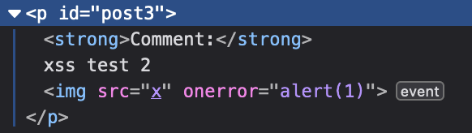

Étant donné que les postes refusés sont envoyés à l'administrateur, on peut d'exploiter cette
XSS pour forcer l'administrateur à effectuer des actions ou exfiltrer ses cookies.
Pour faire cela il faut un serveur publique qui peut recevoir de requêtes HTTP. Le service **Pipedream** peut être utilisé pour ça.

On peut utiliser le payload suivant dans le commentaire du poste, puis ensuite cliquer sur *Refuser* pour qu'il soit  :

```html

```

Le cookie va donc être exfiltré vers le serveur que l'on contrôle et on va pouvoir le retrouver dans les logs du serveur, ou sur l'endpoint Pipedream :

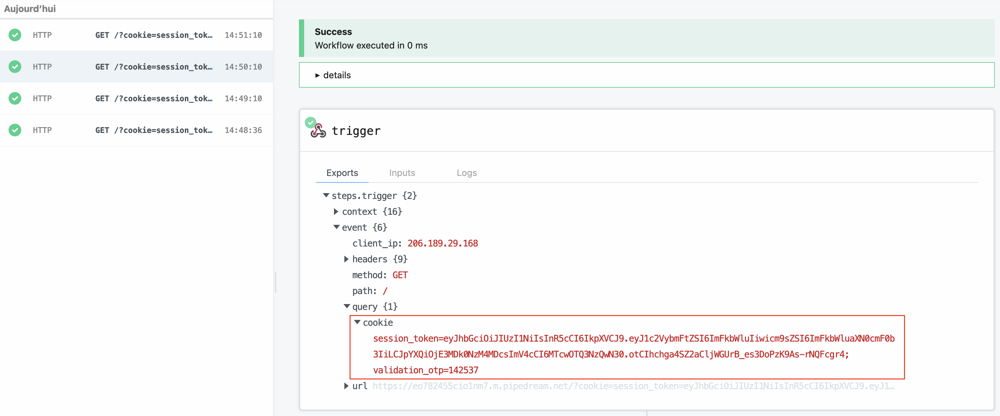

Enfin, en utilisant le cookie récupéré on peut finalement accéder à la page d'administration et obtenir le flag :

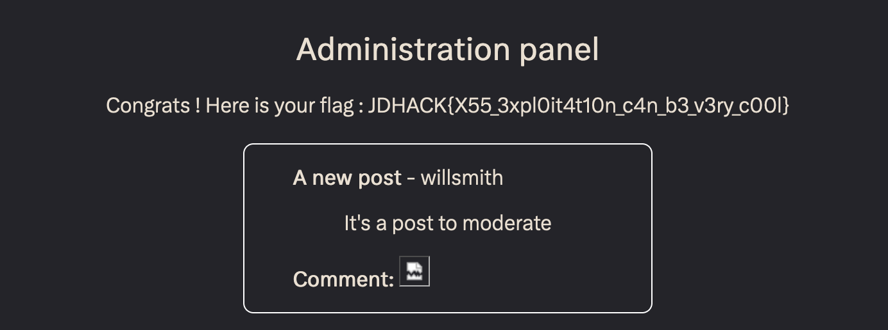