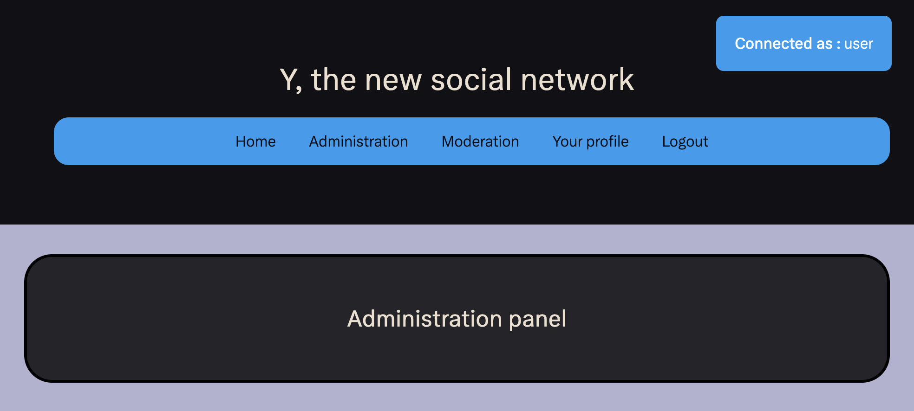
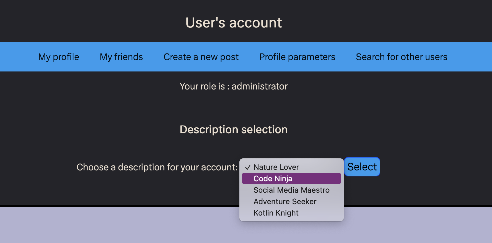
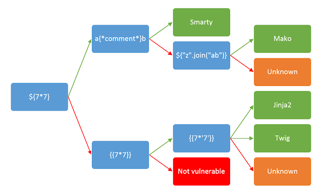
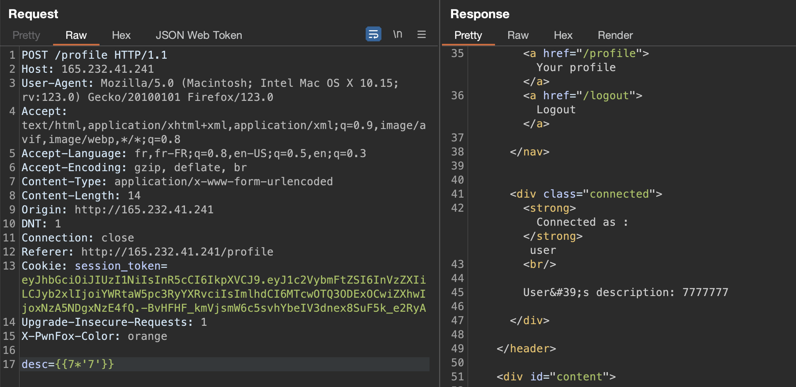
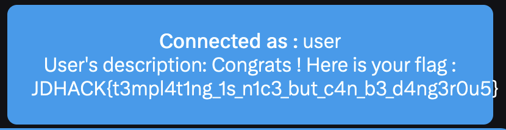

# Jeanned'Hack CTF - Writeup

## Réseau social Y - 3/3

| Catégorie | Difficulté | Points |
|-----------|------------|--------|
| Web       | Difficile  | 995    |

Le dernier challenge sur la plateforme Y, le nouveau réseau social.

### Exploitation d'une SSTI (Server-Side Template Injection)

Cette fois, un compte administrateur est fourni pour avoir accès à toute la plateforme.
Suite à un problème ce compte a été désactivé mais chaque nouveau compte créé était administrateur.



Après quelques recherches, on peut remarquer qu'il n'y a qu'une seule nouvelle fonctionnalité :



Une fois selectionnée, la description est affiché en dessous du nom d'utilisateur. On peut tenter plusieurs injections comme des XSS dans ce paramètre, mais sans succès.

On sait que le flag est à récupérer sur le serveur, il y aura donc besoin d'obtenir un inclusion de fichier local (LFI) ou bien de l'exécution de code à distance (RCE).

Il s'agit d'un serveur Python3 qui utilise le framework Flask. Ce type de serveur utilise du templating pour le rendu des pages HTML. Cela peut introduire des vulnérabilités de type Server-Side Template Injection (SSTI).

Le schéma suivant permet de trouver le moteur de templating utilisé par l'application lorsqu'on trouve une SSTI :



En testant ici on découvre que le paramètre `desc` est vulnérable, et de plus que le moteur utilisé est **Jinja2**.



En utilisant le payload `{{7*'7'}}`, la description de l'utilisateur affiche `7777777`, ce qui indique que le code est bien exécuté.

Il faut maintenant trouver un payload permettant d'exécuter du code. Il y a plusieurs manières de faire, on peut par exemple utiliser le payload suivant pour énumérer les fonctions et class disponibles, et ensuite trouver une classe nous permettant d'exécuter du code (`os`, `subprocess`...) :

```
{{''.__class__.__mro__[1].__subclasses__()}}
```

Si l'objet `request` est accessible on peut également l'utiliser pour exécuter des commandes assez facilement.

Pour finir, il fallait récupérer le flag dans le fichier `/app/flag.txt`, et donc on peut utiliser le payload suivant :

```
{{request.application.__globals__.__builtins__.__import__('os').popen('cat /app/flag.txt').read()}}
```



### Ressources utiles

Une ressource pour exploiter les SSTI avec Jinja2 : https://book.hacktricks.xyz/pentesting-web/ssti-server-side-template-injection/jinja2-ssti

Et une liste de payloads très utile : https://github.com/swisskyrepo/PayloadsAllTheThings/tree/master/Server%20Side%20Template%20Injection