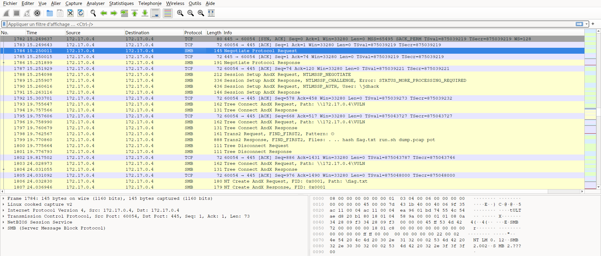
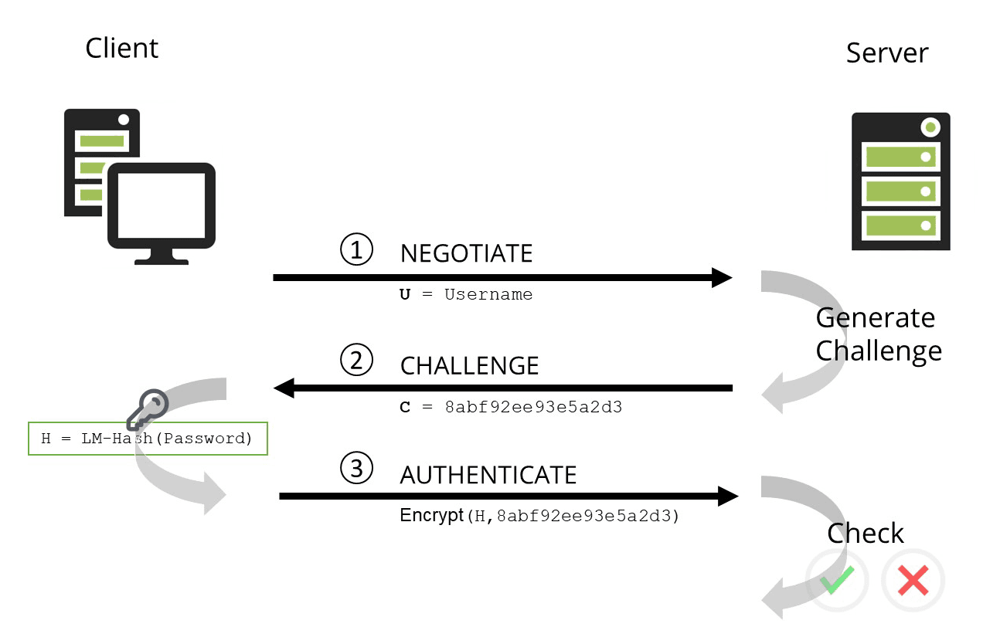
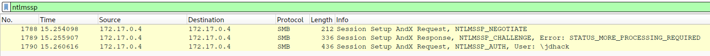
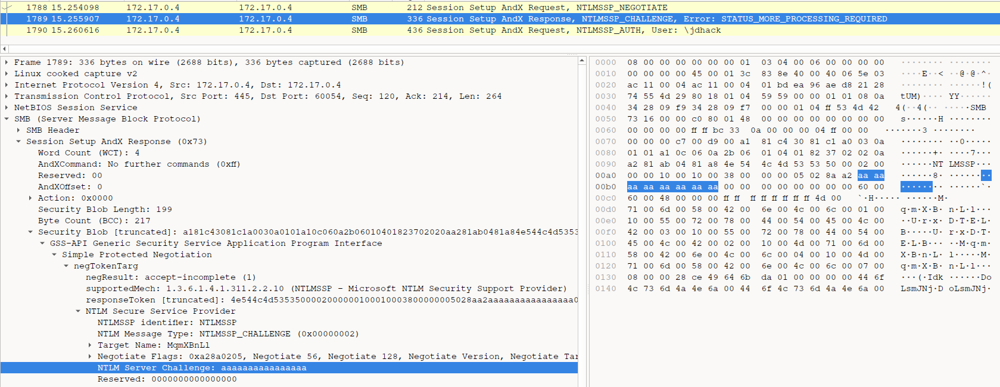
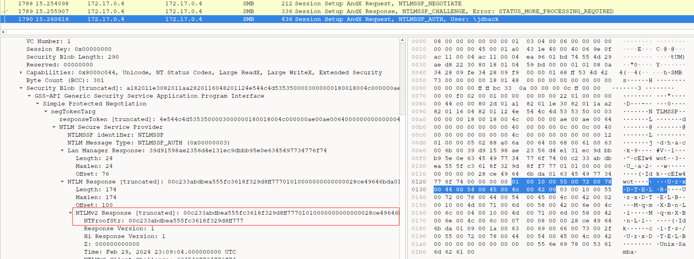
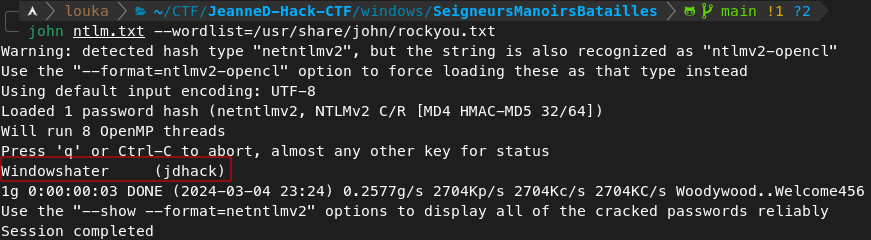

# Jeanned'Hack CTF - Writeup

## Seigneurs, Manoirs et Batailles

| Catégorie | Difficulté | Points  |
|-----------|------------|---------|
| Windows   | Moyen      | 989     |

## Description

Vous avez intercepté des communications des pigeons voyageurs ennemis. Essayez de déchiffrer cette série de communications et d'y retrouver le mot de passe de l'utilisateur sur cette machine Windows.

Fichier attaché : `capture.pcap`

## Writeup

Le fichier fourni est une capture réseau PCAP. On peut l'ouvrir avec un logiciel comme **Wireshark** pour l'analyser. Le but est de retrouver le mot de passe d'un utilisateur Windows à partir de ce fichier.

Pour commencer, il y a beaucoup de bruits et de fausses pistes dans ce fichier (spoiler: c'est fait exprès :smiling_imp:). En fouillant le fichier on peut identifier des échanges utilisant le protocole **SMB**. C'est le seul protocole de cette capture qui est plus souvent utilisé par des machines Windows, c'est donc la piste la plus probable (ça et le nom du challenge).



L'authentification auprès du serveur SMB repose ici sur le protocole **NTLM**, utilisée sur Windows. Il est décrit rapidement dans le schéma ci-dessous :



On peut extraire uniquement les paquets en lien avec l'authentification en appliquant le filtre `ntlmssp` (NTLM Secure Service Provider) sur Wireshark. L'utilisateur tentant de se connecter s'appelle `jdhack` :



Maintenant, il faut retrouver dans ces paquets les informations suivantes pour reconstruire de quoi casser le mot de passe de l'utilisateur :

- Le nom d'utilisateur,
- Le challenge du serveur,
- La réponse de l'utilisateur au challenge, c'est-à-dire le HMAC-MD5 du challenge en utilisant le hash LM de son mot de passe comme secret,
- Et la réponse NTLMv2 complète.

Ici on peut retrouver le challenge du serveur :



Et ici le HMAC-MD5 (`NTProofStr`) et la réponse NTLM (`NTLMv2 Response`) :



On peut ensuite construire le hash de la manière suivante :
```
User:::Server-Challenge:HMAC-MD5:NTLMv2Response
```

Ce qui donne :
```
jdhack:::aaaaaaaaaaaaaaaa:00c233abdbea555fc3618f329d8ff777:01010000000000000028ce49646bda016345497734776f7400000000010010005500720078004400540045004c004200030010005500720078004400540045004c004200020010004d0071006d00580042006e004c006c00040010004d0071006d00580042006e004c006c00070008000028ce49646bda0109001a0063006900660073002f005500720078004400540045004c0042000000000000000000
```

Enfin on peut stocker ce hash dans un fichier et tenter de le cracker avec `john` ou `hashcat` et notre meilleur wordlist (`rockyou.txt`) et récupérer le mot de passe :



Et c'est gagné : `FLAG{Windowshater}`.

## Liens utiles

Vidéo explicative [ici](https://www.youtube.com/watch?v=lhhlgoMjM7o).
